# k0rdent Enterprise 1.1.0 AWS AMI Image

# Quick Start

## Sign in to your AWS account

1. [Mirantis AWS portal](https://mirantis.awsapps.com/start/#/?tab=accounts)

## Find the latest AMI Image

1. Go to the latest [k0rdent Enterprise AMI Image page](https://us-west-1.console.aws.amazon.com/ec2/home?region=us-west-1#ImageDetails:imageId=ami-0035dcaa41e1313f7).  
2. Click upper right corner { width="150" }button.

## Fill the **Launch an instance** form

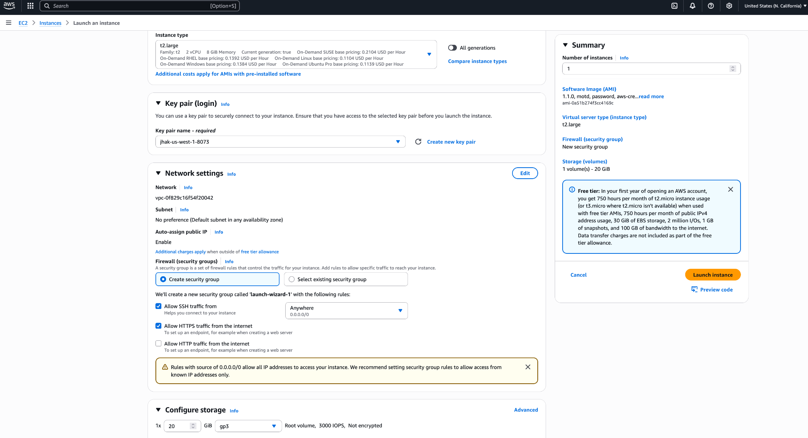

1. ### “**Name**”

Any proper name of your k0rdent EC2 instance.

2. ### “**Application and OS Images**”

   Keep pre-filled k0rdent AMI.

3. ### “**Instance type**”

**t2.large** or bigger.

4. ### “**Key pair**”

Create or use an existing one if you have it. You will need that to access your k0rdent EC2 using **ssh** and use management commands (update UI password, setup cloud providers credentials etc.)

#### Recommended steps to create the Key pair

1. Use RSA \- pem.  
   2. Name it e.g. **jhak-us-west-1-8073.pem** (username, AWS region, last 4 digits from AWS account). You may have more Key pairs so it’s good to track them properly using naming convention.  
   3. Save it to your **\~/.ssh** folder.  
   4. Update the file attributes using **chmod 0600 \~/.ssh/\<filename\>.pem** command to protect it.

5. ### “**Network Settings**”

   1. #### “Network”

      Use the default value “vpc-...”.

   2. #### “Subnet”

      Use the default value “No preference…”.

   3. #### “Auto-assign public IP”

      Enable (default value).

   4. #### “Firewall (security groups)”

      Use “Create security group”.  
      Check: Allow SSH traffic from: Anywhere (enabled by default).  
      **Check: Allow HTTPS traffic from the internet: Anywhere (disabled by default).**

   5. #### “Network”

   Use the default value “vpc-...”.

   6. #### “Subnet”

      Use the default value “No preference…”.

   7. #### “Auto-assign public IP”

      Enable (default value).

6. ### “**Configure storage**”

   At least: 1x 20 GiB gp3 (default value).

7. ### “**Advanced details**”

   No requirements, keep default values.  
   

## Launch k0rdent instance

* Start instance using bottom right button { width="150" }

## Check your EC2 Instance

* Check your EC2 Instance in “[EC2 \> Instances](https://us-west-1.console.aws.amazon.com/ec2/home?region=us-west-1#Instances:)” board.

* Wait for 2/2 checks passed Status check value.

## Access k0rdent Web UI

* Access your k0rdent instance Web UI using “open address” link from the EC2 instance detail or directly using “**https://\<EC2-instance-IP\>**” from your web browser.

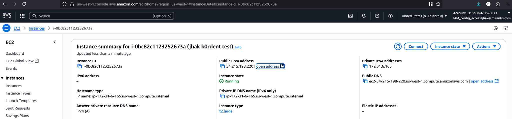

* Use default credentials to sign into the k0rdent Web UI:  
  * username: **admin**  
  * password: **admin**

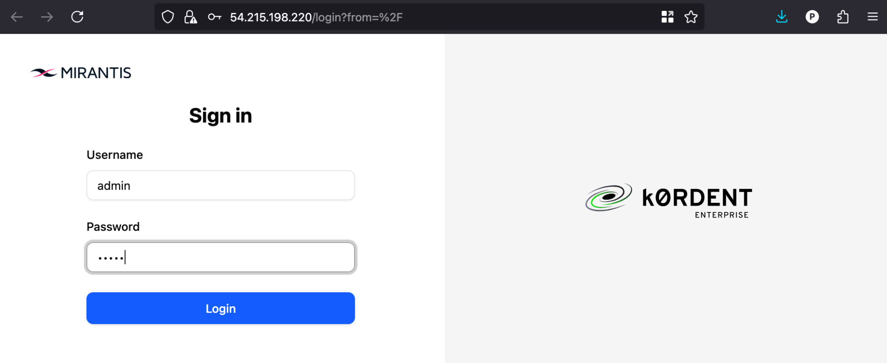

## Manage k0rdent Instance using CLI

Some important functions are not available from Web UI yet so we provide them as CLI commands. You need to access the Instance using ssh to use them.

### Access the Instance using SSH

* Sign in to the EC2 instance using the **ssh** client along with your **key pair .pem** file:

~~~bash
ssh -i ~/.ssh/<key-pair-file>.pem ubuntu@<EC2-instance-IP>
# e.g., ssh -i ~/.ssh/jhak-us-west-1-8073.pem ubuntu@54.215.198.220
~~~

* Upon signing in, you’ll be greeted with an overview of available k0rdent commands displayed as the system’s “message of the day,” just like on Linux.

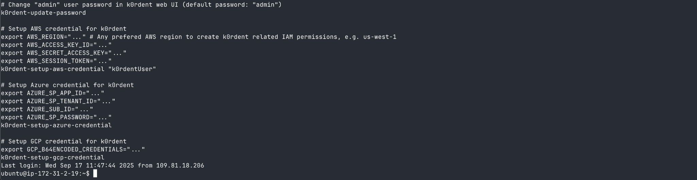

### Change the default Web UI Password

* Change the default Web UI password now to ensure the basic security of the k0rdent instance:

~~~bash
k0rdent-update-password
~~~

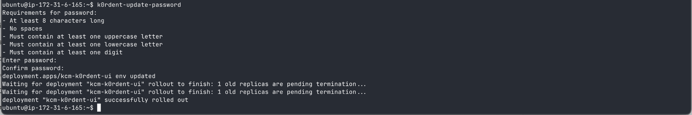

* After setting the new password, wait for the message confirming that the UI component has been successfully restarted. Then, sign in to the Web UI again using the new password.

### Set up your AWS credential

- Export your credentials:

~~~bash
# aws region to setup roles and permission stack.
# You can copy following values from https://mirantis.awsapps.com/start/#/?tab=accounts - "Access Keys" dialog.
export AWS_REGION="..."
export AWS_ACCESS_KEY_ID="..."
export AWS_SECRET_ACCESS_KEY="..."
export AWS_SESSION_TOKEN="..."
~~~

* Now you can set up your k0rdent AWS credentials to be able to create a child cluster in AWS using **k0rdent-setup-aws-credential** **\<Any Name\>** command. 

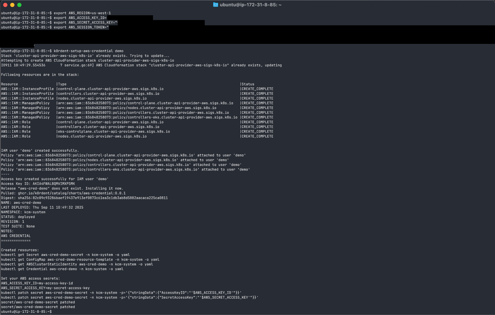

* After the command usage, the aws-credential object is ready to use in your k0rdent Instance.

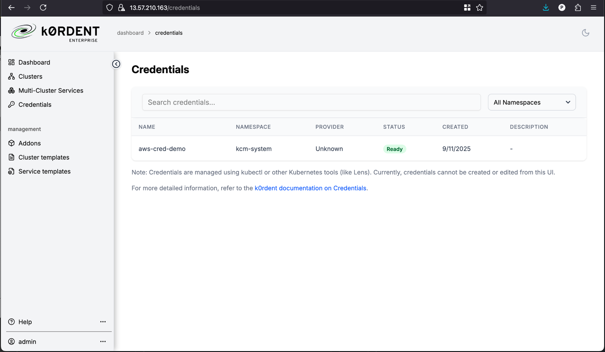

### Set up your Azure credential

* Now you can set up your k0rdent Azure credentials to be able to create a child cluster in Azure using **k0rdent-setup-azure-credential** command. See how to obtain the vars in [k0rdent docs](https://docs.k0rdent.io/latest/quickstarts/quickstart-2-azure/). You need to set these environment variables before:

~~~bash
export AZURE_SP_APP_ID="..."
export AZURE_SP_TENANT_ID="..."
export AZURE_SUB_ID="..."
export AZURE_SP_PASSWORD="..."
~~~

* No run **k0rdent-setup-azure-credential** command. It will create two Azure credential objects as there is a separated credential object for AKS.

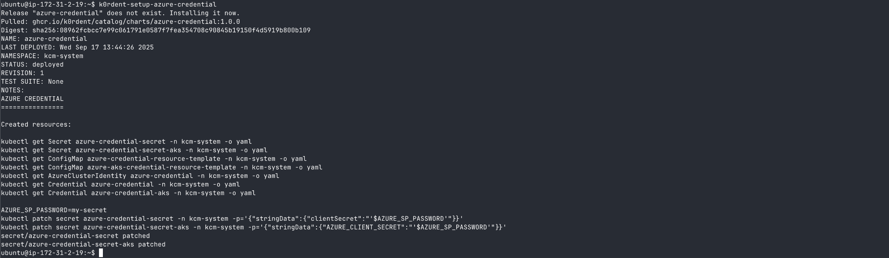
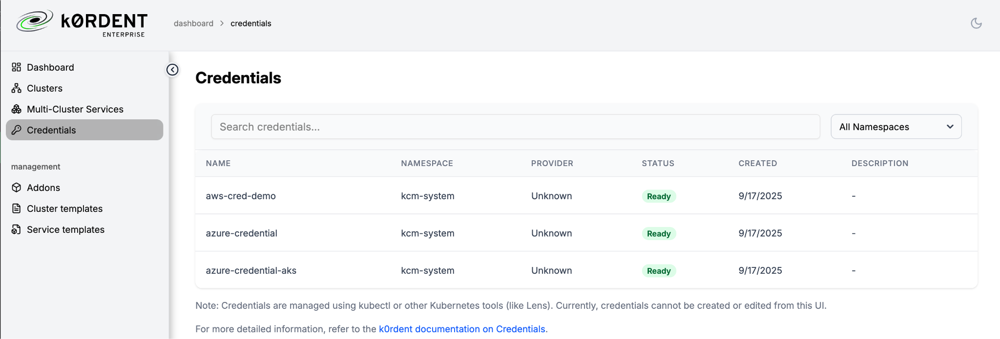

### Set up your GCP (Google cloud) credential

* Now you can set up your k0rdent GCP credentials to be able to create a child cluster in GCP using **k0rdent-setup-gcp-credential** command. See how to obtain the vars in [k0rdent docs](https://docs.k0rdent.io/latest/quickstarts/quickstart-2-gcp/). You need to set this environment variable before:

~~~bash
export GCP_B64ENCODED_CREDENTIALS="..."
~~~

* No run **k0rdent-setup-gcp-credential** command. It will create GCP credential object.

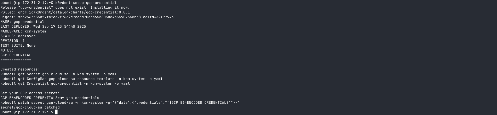
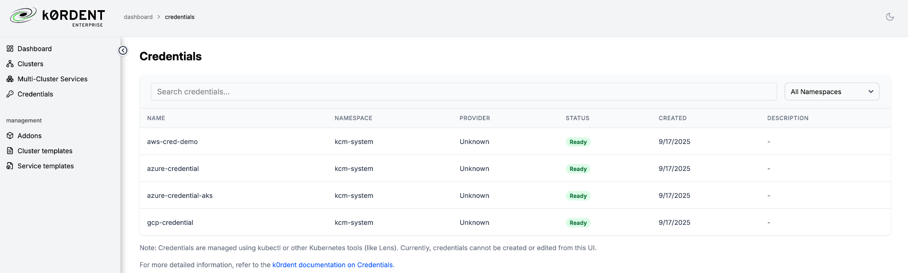

## Deploy AWS cluster

* Use “Clusters \> Create Cluster  
* Set cluster name, e.g. **aws-demo-cluster**  
* Namespace: **kcm-system**  
* Cluster Template: **AWS \> aws-standalone-cp-1-0-12**

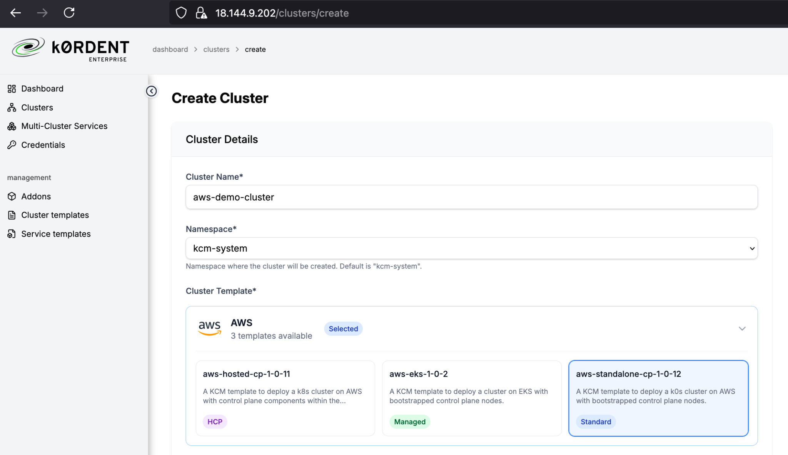

* Provider Credential: **aws-cred-demo**  
* Use YAML config mode and paste simple configuration:

~~~yaml
controlPlane:
  instanceType: t3.small
controlPlaneNumber: 1
publicIP: false
region: us-west-1
worker:
  instanceType: t3.medium
  rootVolumeSize: 16
workersNumber: 1
~~~

* Add cluster label: **“group”: “demo”.**  
* Click **Create Cluster**.

* Wait for cluster **Ready** state.

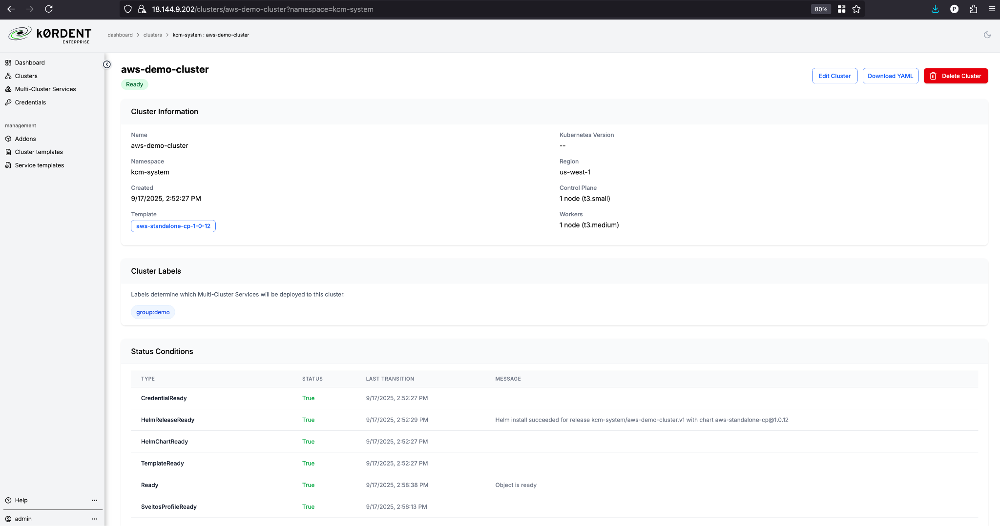

## Install Service templates

* Install **ingress-nginx** and **kubecost** service templates from **Addons** menu.

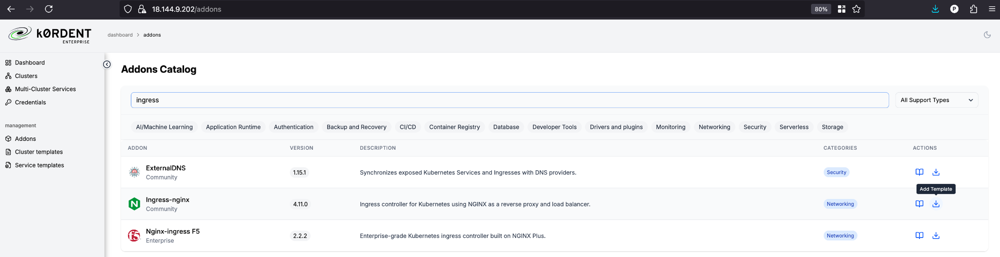

* Use default values:

| 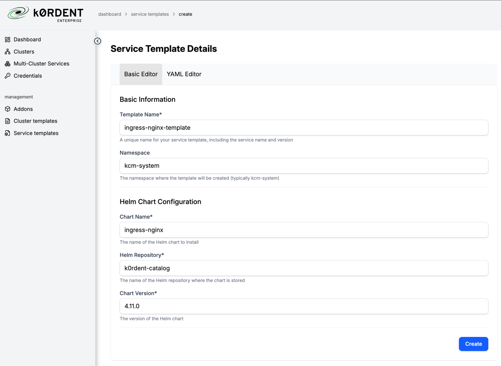 | 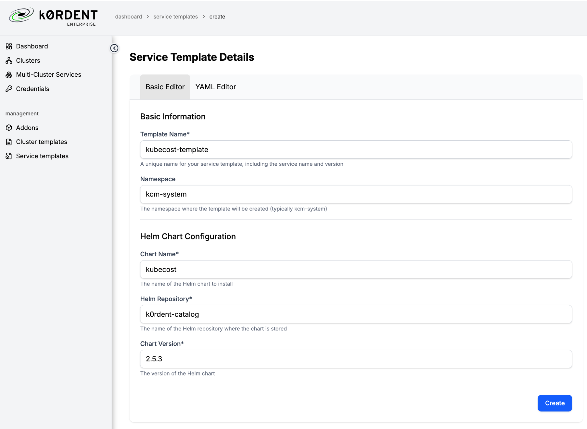 |
| :---- | :---- |

## Create services

### Ingress-nginx

* Set values from the screenshot.  
* Ensure proper cluster labels to select the cluster created before.

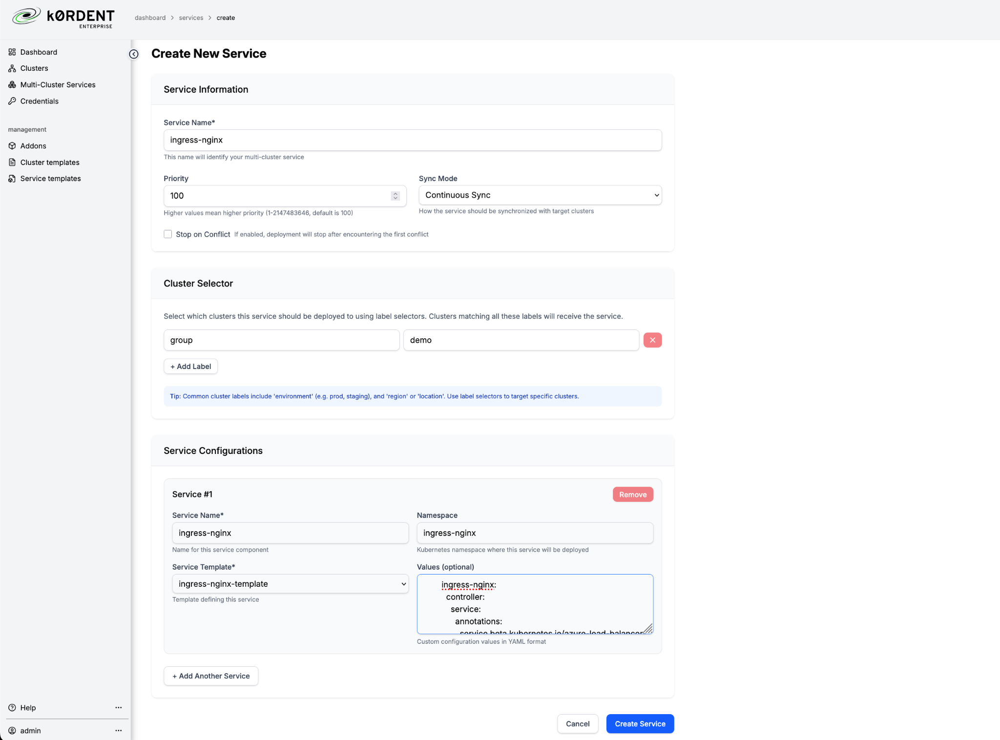

* Copy Helm values from [Catalog page](https://catalog.k0rdent.io/latest/apps/ingress-nginx/#verify-service-template).

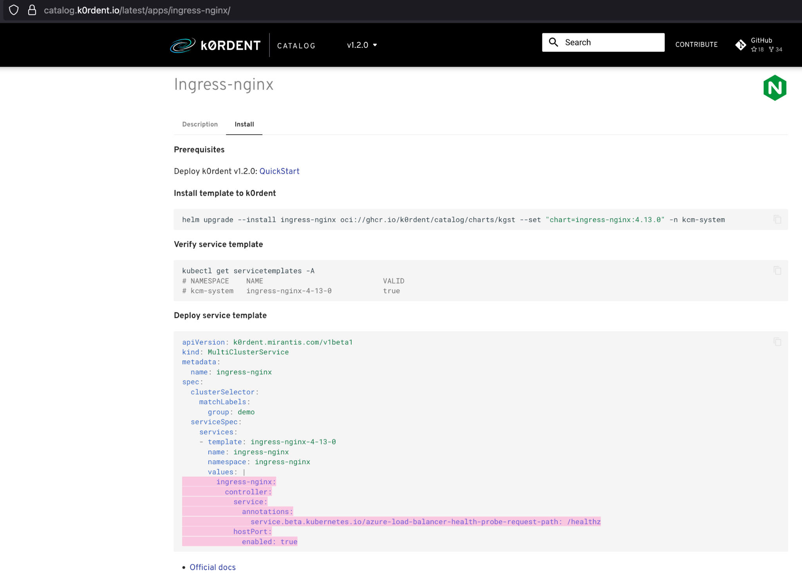

* Click **Create Service**  
* Wait for **Ready** status, and there should be 1 cluster assigned.

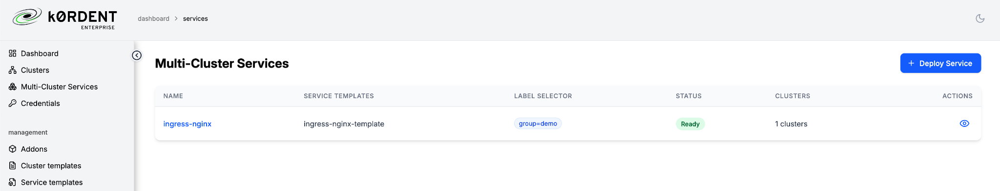

### Kubecost

* Deploy similarly to ingress-nginx.  
* Copy Helm values from [Catalog item](https://catalog.k0rdent.io/latest/apps/kubecost/#install-template-to-k0rdent).

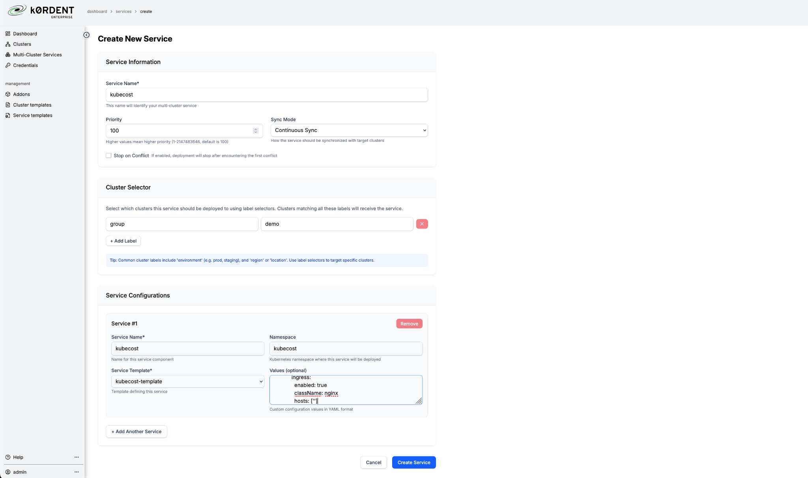

* Wait for **Ready** status again:

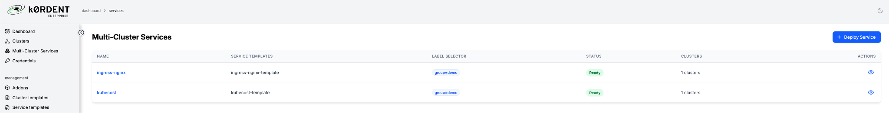

### Access Web App

* Use CLI command **k0rdent-show-ingress aws-demo-cluster**:

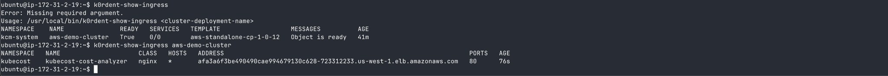

* Use the address to access the app:

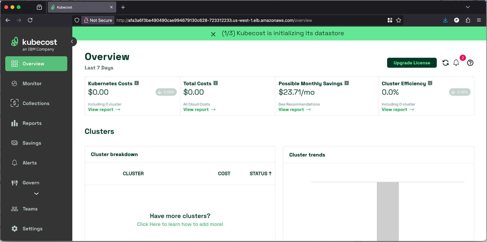

## Deploy Azure Cluster

* Use “Clusters \> Create Cluster  
* Set cluster name, e.g. **azure-demo-cluster**  
* Namespace: **kcm-system**  
* Cluster Template: **Azure \> azure-standalone-cp-1-0-13**

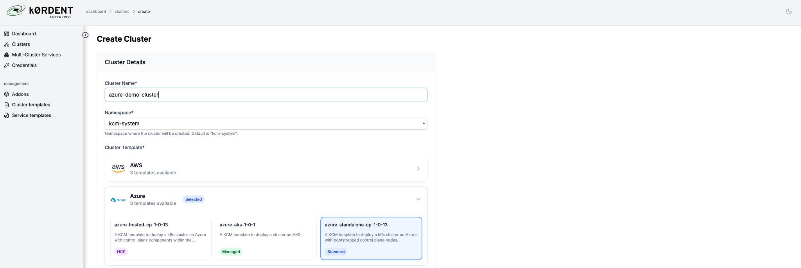

* Provider Credential: **azure-credential** (that was created above)  
* Click on Yaml editor  
* Delete all default contents  
* Paste in the following contents and update subscriptionID to match the azure credentials

~~~yaml
controlPlaneNumber: 1
workersNumber: 1
location: "westus"
subscriptionID: TODO-AZURE_SUB_ID
controlPlane:
  vmSize: Standard_A4_v2
worker:
  vmSize: Standard_A4_v2
~~~

* Click **Create Cluster**.

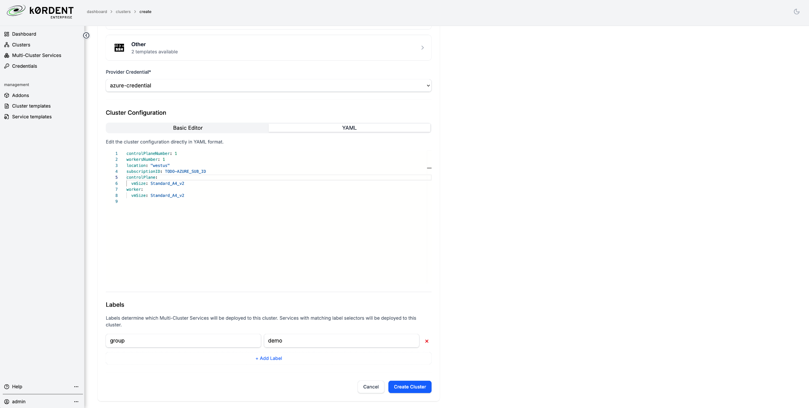

* Wait for cluster **Ready** state.

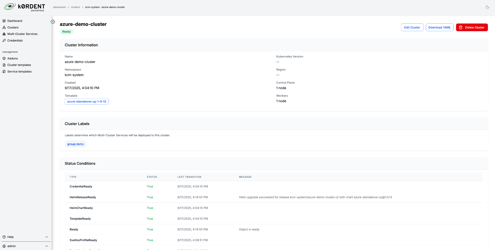

### Get ingress addresses

* You can get ingress address of exposed apps:

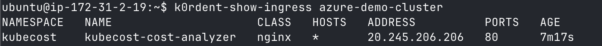

* Then access the given address from the browser (http://\<ip-address\>).

## Deploy GCP cluster

* Use “Clusters \> Create Cluster  
* Set cluster name, e.g. **gcp-demo-cluster**  
* Namespace: **kcm-system**  
* Cluster Template: **GCP \> gcp-standalone-cp-1-0-12**

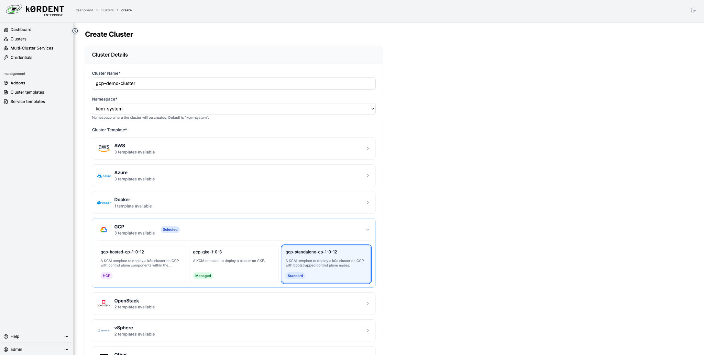

* Provider Credential: **gcp-credential**  
* Use YAML config mode, replace  and paste configuration below:

~~~yaml
project: "k0rdent-83792" # your GCP project ID
region: "us-west1"
controlPlane:
  instanceType: "e2-small"
  image: projects/ubuntu-os-cloud/global/images/ubuntu-2004-focal-v20250213
  publicIP: true
controlPlaneNumber: 1
worker:
  instanceType: "e2-medium"
  image: projects/ubuntu-os-cloud/global/images/ubuntu-2004-focal-v20250213
  publicIP: true
  rootVolumeSize: 16
workersNumber: 1
~~~

* Click **Create Cluster**.

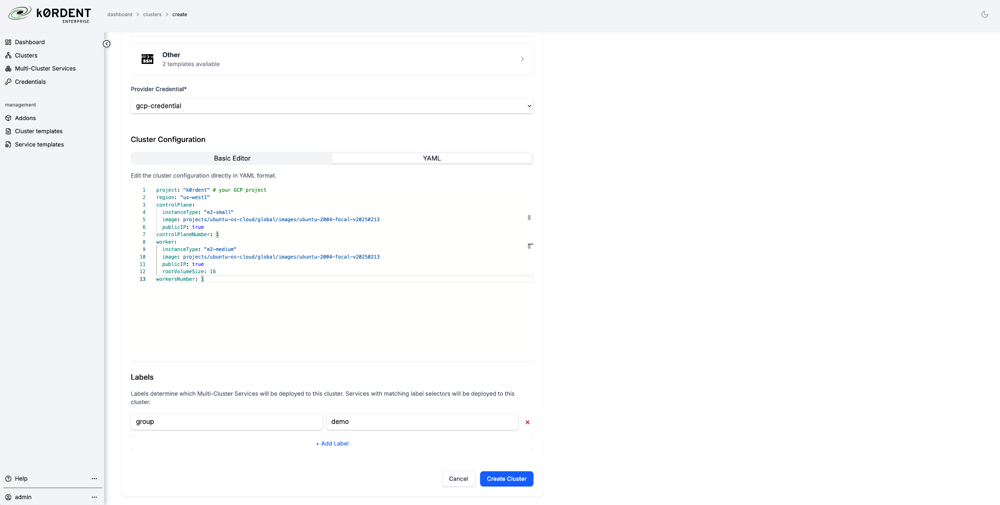

* Wait for cluster **Ready** state.

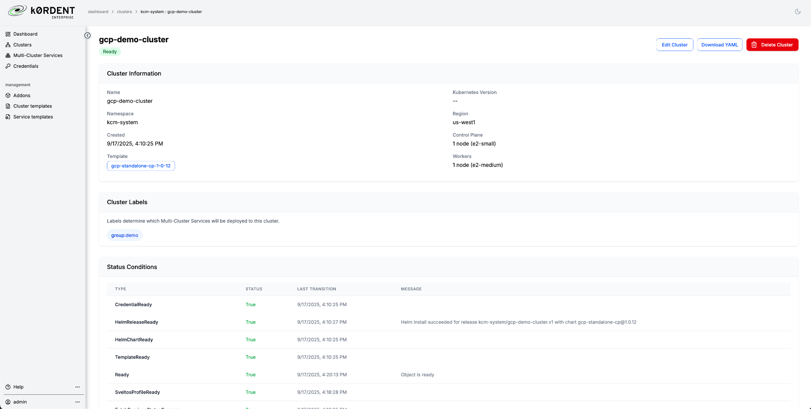

### Get ingress addresses

* You can get ingress address of exposed apps:

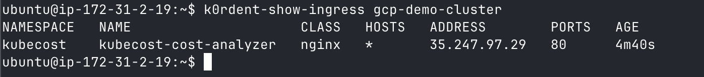

* Then access the given address from the browser (http://\<ip-address\>).

## Delete clusters

* You can delete any or all clusters using the **Delete** button.

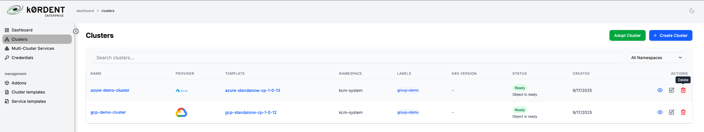

* You will be asked to confirm the deletion.

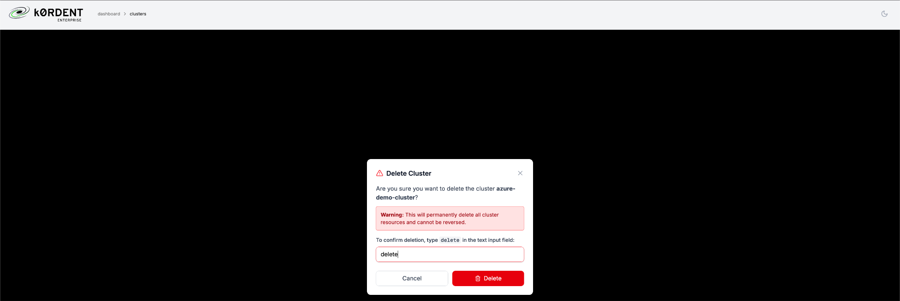
